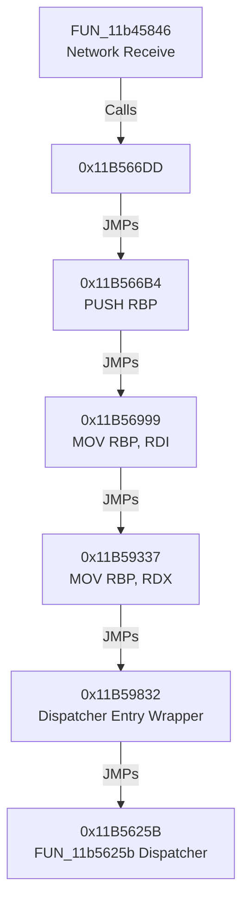

# pass626 VM Entry Context Mapping

This document details the register initialization sequence that maps native context into the VM interpreter variables before dispatcher entry.

---

## Step-by-Step Initialization Chain

### Detailed Instruction Trace:
1. **Network Loop Hook (`0x11B566B4`)**:
   - `PUSH RBP` (preserves RBP).
   - `JMP 0x11b56999`.
2. **Context Stage 1 (`0x11B56999`)**:
   - `MOV RBP, RDI` (copies RDI parameter into RBP).
   - `JMP 0x11b56075` (thunk to `FUN_11b59337`).
3. **Context Stage 2 (`0x11B59337`)**:
   - `MOV RBP, RDX` (overwrites RBP with RDX - the second standard Windows x64 calling convention argument).
   - `JMP 0x11b59832` (enters dispatcher initialization).
4. **Dispatcher Entry (`0x11B5625B`)**:
   - `ADD RSI, qword ptr [RBP]` (loads PC offset from the context struct pointing at RBP, updates instruction pointer RSI).
   - `MOV AL, byte ptr [RSI]` (fetches next opcode raw byte).
   - `SUB AL, BL` (decrypts opcode using initial/rolling key byte BL passed from caller in RBX).
