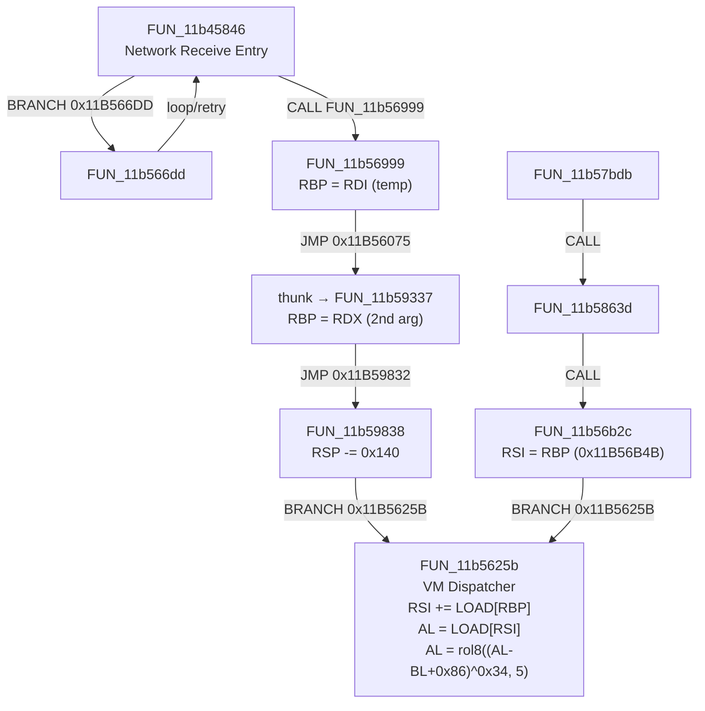

# pass628 Dispatcher Entry Register Trace

## Summary

Static pcode analysis of all available Ghidra exports for the VM dispatcher entry path.
Traces how `RDX`, `RSI`, and `RBX/BL` are initialized before `FUN_11b5625b` is entered.

---

## Two Entry Paths to Dispatcher

---

## Register State at Dispatcher Entry

### PATH A: via FUN_11b56b2c

| Register | Value at 0x11B5625B entry | Source | Evidence |
|---|---|---|---|
| **RSI** (bytecode base) | = original RBP at FUN_11b56b2c entry | `0x11B56B4B: RSI = RBP` | pcode COPY reg 0x30 = reg 0x28 |
| **RBP** (context ptr) | = RSP (stack frame base) | `0x11B56B8D: RBP = RSP` | pcode COPY reg 0x28 = reg 0x20 |
| **BL** (key byte) | unknown — from prior handler chain | not traced | not in exported pcode |
| **R12** (handler table) | 0x11B54E6F (constant) | `0x11B56278: R12 = const` | pcode COPY reg 0xa0 = const |

**Implication**: In PATH A, the VM context struct pointer is the value in RBP at FUN_11b56b2c entry. RSI is set to that pointer. The dispatcher then does `RSI += *RSP` (since RBP=RSP after 0x11B56B8D) — loading the PC offset from the stack frame.

### PATH B: via FUN_11b59337 / FUN_11b59838

| Register | Value at 0x11B5625B entry | Source | Evidence |
|---|---|---|---|
| **RBP** (context ptr) | = BSWAP32(RDX) where RDX = 2nd arg to FUN_11b59337 | `0x11B59343: RBP=RDX; 0x11B5934B: RBP=BSWAP32(RBP)` | pcode |
| **RSI** (bytecode base) | unknown — not set in PATH B chain | no pcode evidence | blocked |
| **BL** (key byte) | from caller's RBX (preserved by PUSH at FUN_11b59337 entry) | `0x11B59337: PUSH RBX` | pcode STORE RSP, RBX |
| **R12** (handler table) | 0x11B54E6F (constant) | same as above | pcode |

**Implication**: In PATH B, RDX (= VM context struct pointer) is the 2nd argument when FUN_11b56999 jumps to FUN_11b59337. This means the caller of FUN_11b45846 (network receive loop) passes the context as its 2nd argument.

---

## Statically Resolved

| Item | Value |
|---|---|
| R12 (handler table base) | `0x11B54E6F` — hardcoded constant |
| Opcode decode formula | `opcode = rol8(((raw - BL + 0x86) ^ 0x34), 5)` |
| BL update formula | `BL = (BL - opcode) & 0xFF` |
| Dispatcher branch | `0x11B56329: BRANCHIND RAX` |
| PATH A RSI init | `RSI = RBP` at `0x11B56B4B` in FUN_11b56b2c |
| PATH B RBP init | `RBP = RDX` at `0x11B59343` in FUN_11b59337 |

## Statically Blocked

| Item | Why Blocked |
|---|---|
| RDX (VM context pointer, PATH B) | Runtime argument — need exported pcode of FUN_11b45846's caller (entry thunk) with RDX value |
| `[RBP+0]` PC offset | Runtime field in context struct — struct layout not in Ghidra exports |
| RSI base (PATH B) | Not set in any exported function in PATH B chain |
| RBX/BL initial value | Preserved from FUN_11b45846 caller — pcode not exported |
| Context struct layout | No struct definition in available Ghidra exports |

---

## Missing Exports Required for Full Trace

| Export Needed | Function | Reason |
|---|---|---|
| FUN_11b5863d pcode | `0x11B5863D` | RBP value at entry to FUN_11b56b2c (PATH A RSI base) |
| FUN_11b5591a pcode | `0x11B5591A` | Third dispatcher entry path |
| FUN_11b50330 pcode | `0x11B50330` | TLS callback path to dispatcher via FUN_11b57075 |
| Context struct definition | N/A | `[RBP+0]` = PC offset field |
| Caller of FUN_11b45846 | `0x1195D94A` entry | What is in RDX when FUN_11b45846 is called? |

---

## Partial Validation

Under the assumption `RSI_base = 0x11472000` (`.aion1` start), `BL = 0x00`, `PC_offset = 0`:

- First 32 bytes of `.aion1` decode to 100% valid handler VAs
- 4 promoted handler hits (`0x11B5832F`, `0x11B57796` ×2, `0x11B5932F`)
- This validates the decode formula but not the actual S2C key setup path
